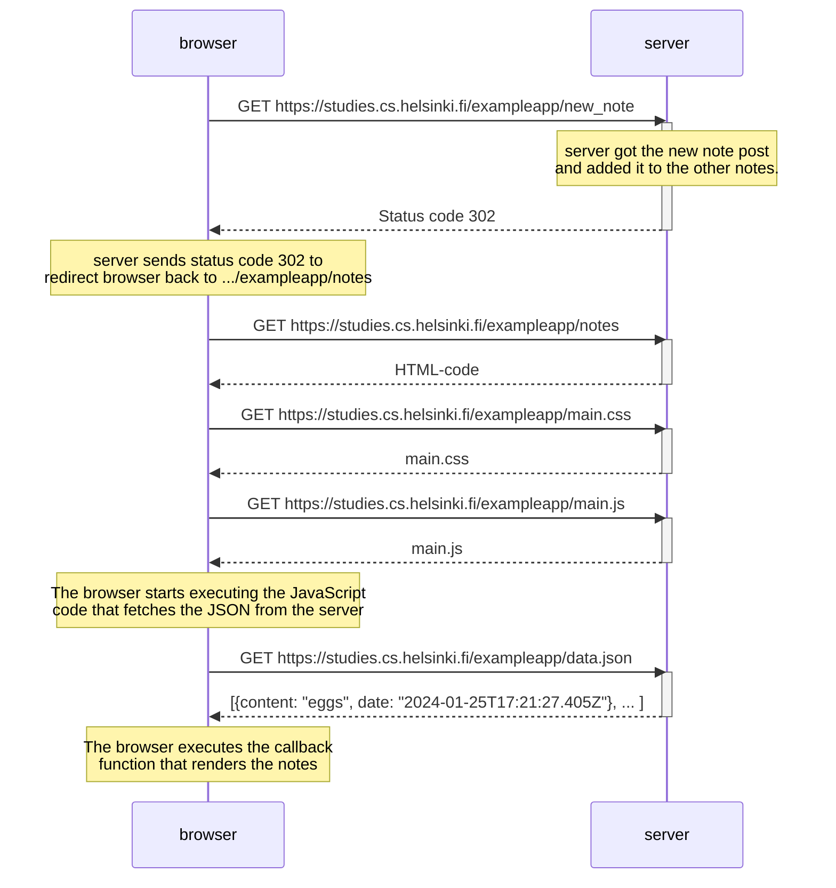

```mermaid
sequenceDiagram
    participant browser
    participant server

    browser->>server: GET https://studies.cs.helsinki.fi/exampleapp/new_note
    activate server
    
    Note over server: server got the new note post<br/>and added it to the other notes.

    server-->>browser: Status code 302
    deactivate server

    Note over browser: server sends status code 302 to<br/>redirect browser back to .../exampleapp/notes

    browser->>server: GET https://studies.cs.helsinki.fi/exampleapp/notes
    activate server
    server-->>browser: HTML-code
    deactivate server

    browser->>server: GET https://studies.cs.helsinki.fi/exampleapp/main.css
    activate server
    server-->>browser: main.css
    deactivate server

    browser->>server: GET https://studies.cs.helsinki.fi/exampleapp/main.js
    activate server
    server-->>browser: main.js
    deactivate server

    Note over browser: The browser starts executing the JavaScript<br/>code that fetches the JSON from the server

    browser->>server: GET https://studies.cs.helsinki.fi/exampleapp/data.json
    activate server
    server-->>browser: [{content: "eggs", date: "2024-01-25T17:21:27.405Z"}, ... ]
    deactivate server

    Note over browser: The browser executes the callback<br/>function that renders the notes
```