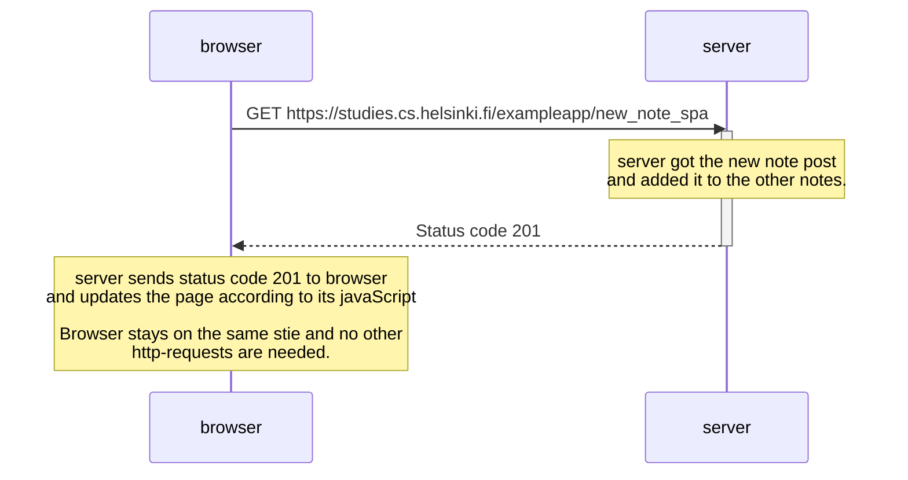

```mermaid
sequenceDiagram
    participant browser
    participant server

    browser->>server: GET https://studies.cs.helsinki.fi/exampleapp/new_note_spa
    activate server
    
    Note over server: server got the new note post<br/>and added it to the other notes.

    server-->>browser: Status code 201
    deactivate server

    Note over browser: server sends status code 201 to browser<br/>and updates the page according to its javaScript<br/><br/>Browser stays on the same stie and no other<br/>http-requests are needed.
```